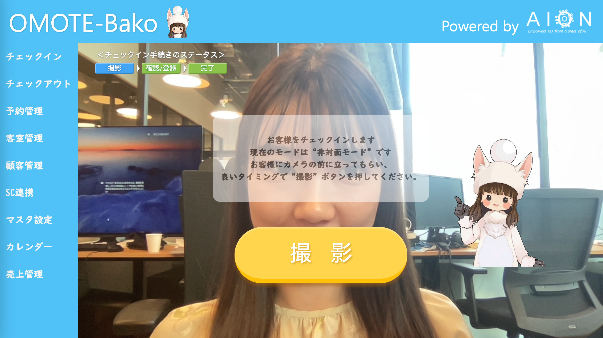

# WebRTC
AIONでは、WebRTCはブラウザで利用可能な API として用いられます。ビデオ、音声、および一般的なデータをリアルタイムにやり取りすることができます。

下記は、実際にAIONにてWebRTCを用いて開発された、エッジコンピューティングによる、顔画像認証チェックイン・チェックアウトシステムのUI画面です。

このエッジ顔認証チェックイン・チェックアウトシステムの関連リソースは、WebRTC以外に、次の通りです。   
 
*  [aion-core](https://github.com/latonaio/aion-core) / kubernetes master node などの主要リソース   
*  [redis-cluster(kube)](https://github.com/latonaio/redis-cluster-kube)、[mysql-kube](https://github.com/latonaio/mysql-kube) などの主要DB   
*  ui-frontend(kube)（Reactフレームワーク）   
*  ui-backend(kube)（JSフレームワーク）   
*  register-an-image-to-face-api-kube   
*  face-recognition-from-an-image(kube)   
*  AzureFaceAPI   
*  get-response-of-face-api-kube   
*  register-guest-face-master-kube   

